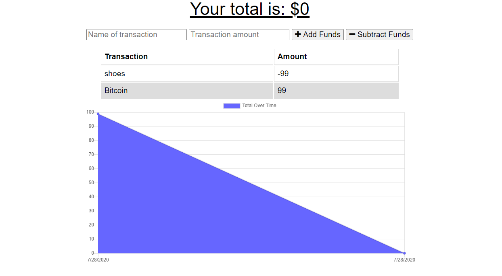

# Budget Tracker
## Workout Tracker

## Table of Contents
  * [Description](#description)
  * [Installation](#installation)
  * [Usage](#usage)
  * [Contributing](#contributing)
  * [License](#license)
  
  ## Description
  The purpose of this project is to create an application in order to keep track of a financial budget. The application will provide the option to increase or deduct funds by label and keep track of an overall balance.  They will also be provided with a graph that shows the accumulation or deduction of funds over time,

  ## Installation
  First download MongoDB at https://www.mongodb.com/try/download/community and clone the repository found at:
https://github.com/brw1820/budget-tracker

Resources such as iTerm and Visual Source Code will also be needed to run the code.

  ## Usage
[Heroku Link for Deployed Application](https://budget-tracker-homework-18.herokuapp.com/)
  
 

## Contributing
This was a solo effort as a project for the Georgia Tech Full-Stack Web Development Program.  

## License
  
Permission is hereby granted, free of charge, to any person obtaining a copy of this software and associated documentation files (the "Software"), to deal in the Software without restriction, including without limitation the rights to use, copy, modify, merge, publish, distribute, sublicense, and/or sell copies of the Software, and to permit persons to whom the Software is furnished to do so, subject to the following conditions:

The above copyright notice and this permission notice shall be included in all copies or substantial portions of the Software.

THE SOFTWARE IS PROVIDED "AS IS", WITHOUT WARRANTY OF ANY KIND, EXPRESS OR IMPLIED, INCLUDING BUT NOT LIMITED TO THE WARRANTIES OF MERCHANTABILITY, FITNESS FOR A PARTICULAR PURPOSE AND NONINFRINGEMENT. IN NO EVENT SHALL THE AUTHORS OR COPYRIGHT HOLDERS BE LIABLE FOR ANY CLAIM, DAMAGES OR OTHER LIABILITY, WHETHER IN AN ACTION OF CONTRACT, TORT OR OTHERWISE, ARISING FROM, OUT OF OR IN CONNECTION WITH THE SOFTWARE OR THE USE OR OTHER DEALINGS IN THE SOFTWARE.
  

